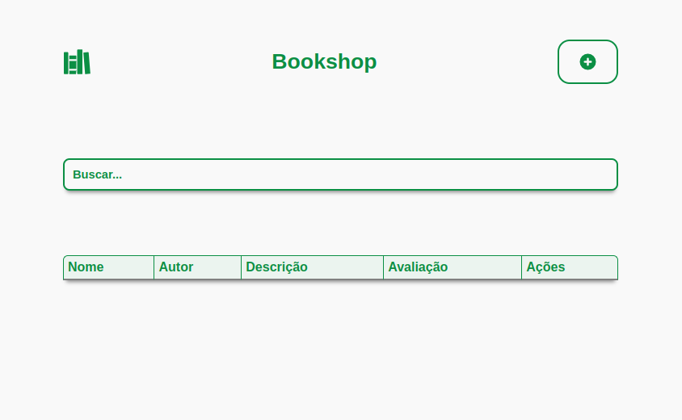

<h1 align="center">
  <svg stroke="currentColor" fill="currentColor" stroke-width="0" viewBox="0 0 512 512" color="#0B8F44" height="35" width="35" xmlns="http://www.w3.org/2000/svg" style="color: rgb(11, 143, 68);"><path d="M84 480H28a12 12 0 01-12-12V92a12 12 0 0112-12h56a12 12 0 0112 12v376a12 12 0 01-12 12zm156-272v-52a12 12 0 00-12-12H124a12 12 0 00-12 12v52zM112 416v52a12 12 0 0012 12h104a12 12 0 0012-12v-52zm0-176h128v144H112zm228 240h-72a12 12 0 01-12-12V44a12 12 0 0112-12h72a12 12 0 0112 12v424a12 12 0 01-12 12zm29-379.3l30 367.83a12 12 0 0013.45 10.92l72.16-9a12 12 0 0010.47-12.9L465 91.21a12 12 0 00-13.2-10.94l-72.13 7.51A12 12 0 00369 100.7z"></path></svg>
  <br>BookShop - softeasy
</h1>



<center>
  <p>Este é o projeto front-end do desafio da sofeasy de construir o web site de uma livraria, totalmente funcional e responsiva.
  </p>
</center>

<h2>Features</h2>

- Pesquisar por livros salvos na nuvem
- Acionar livro ao sistema
- Alterar informações do pesquisado livro
- Achar livro equivalentes para comprar
- Deletar livro desejado do sistema

## 🛠️ Projeto construido com
A construção do projeto foi feito com `<reactjs>` como motor principal para estruturação das páginas e componentes, `<Yup>` para a validação de formulários e inserção para o back-end, `<styled-components>` para estilização isolada de cada elemento dentro do HTML do projeto, `<react-icons>` que disponibiliza icones para usar dentro do projeto e `<axios>` para fazer as requisições e envios para o back-end através de rotas HTTP.


## 💻 Pré-requisitos

Antes de começar, verifique se você atendeu aos seguintes requisitos:

* Você instalou a versão LTS do node js.
* Você tem uma máquina deve possuir um destes sistemas operacionais para prosseguir `<Windows / Linux / Mac>`.
* Fazer download do projeto <a  hrf="https://github.com/Keven-RM/bookshop-server">bookshop-server</a> e inicia-lo antes de usar este projeto.

## 🚀 Instalando BookShop

Para instalar o BookShop, siga estas etapas:

- Baixe o projeto como zip ou git clone.

- Usando o terminal e abra o seu projeto:
  ```
  cd ./sua-pasta/bookshop
  ```
- Instale o projeto usando:
  ```
  npm install
  ```

## ☕ Usando BookShop

Para usar o projeto digite no terminal dentro da pasta do projeto:
```
npm start
```

## 👨‍💻 Desenvolvedor do projeto
O projeto foi desenvolvido inteiramente por <a hrf="https://github.com/Keven-RM">Keven Rodrigues M</a>
<table>
  <tr>
    <td align="center">
        <br>
        <sub>
          <b>Keven RM</b>
        </sub>
    </td>
  </tr>
</table>